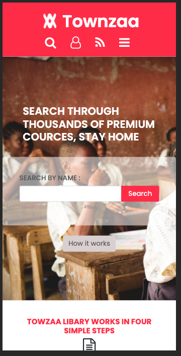
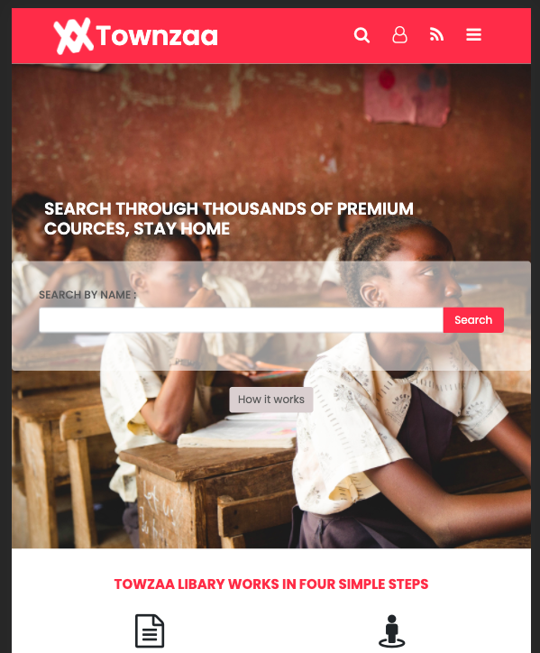

# Townzaa

> Townzaa online course directory

## Built with

- HTML
- CSS
- Bootstrap
- Sass

## Live Demo

[Live Demo Link](https://juxsalley.github.io/html-capstone/index.html)

This project is built to carefully outline how Bootstrap, sass, and CSS can aid in page layout and responsiveness,
working with this project you will understand ad take advantage of CSS processors for page layout and elements positioning.

### Prerequisites

- Text Editor
- internet browser

### Setup

- git clone <link-of-the-repo>
- cd repo-folder
- open in browser

### Install

- No instalation required!

## Authors

👤 **Author1**

- GitHub: [@githubhandle](https://github.com/juxsalley)
- Twitter: [@__salley](https://twitter.com/__salley)
- LinkedIn: [LinkedIn](https://www.linkedin.com/in/dev-salley/)

## 📝 License

This project is [MIT](./LICENSE) licensed.
